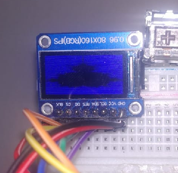

# Examples

## Draw Mandelbrot

Uses the Mandelbrot module created to draw it on an ST7735 display.

## Boucing Balls

Uses the fill_circle custom function added to FrameBuffer implementation of my Micropython fork to draw it on an ST7735 display.

## Doom Fire

Uses the doom_fire custom module with the type DoomFire to draw it on an ST7735 display.

