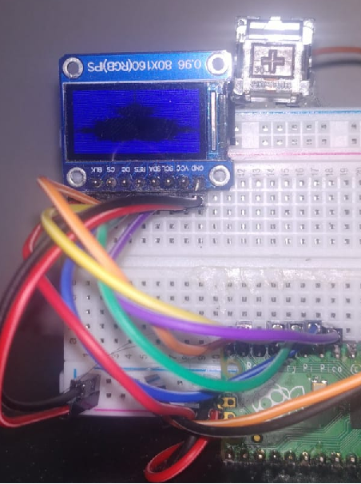

# Examples

## Draw Madelbrot

Uses the Madelbrot module created to draw it on an ST7735 display.

## Boucing Balls

Uses the fill_circle custom function added to FrameBuffer implementation of my Micropython fork to draw it on an ST7735 display.

